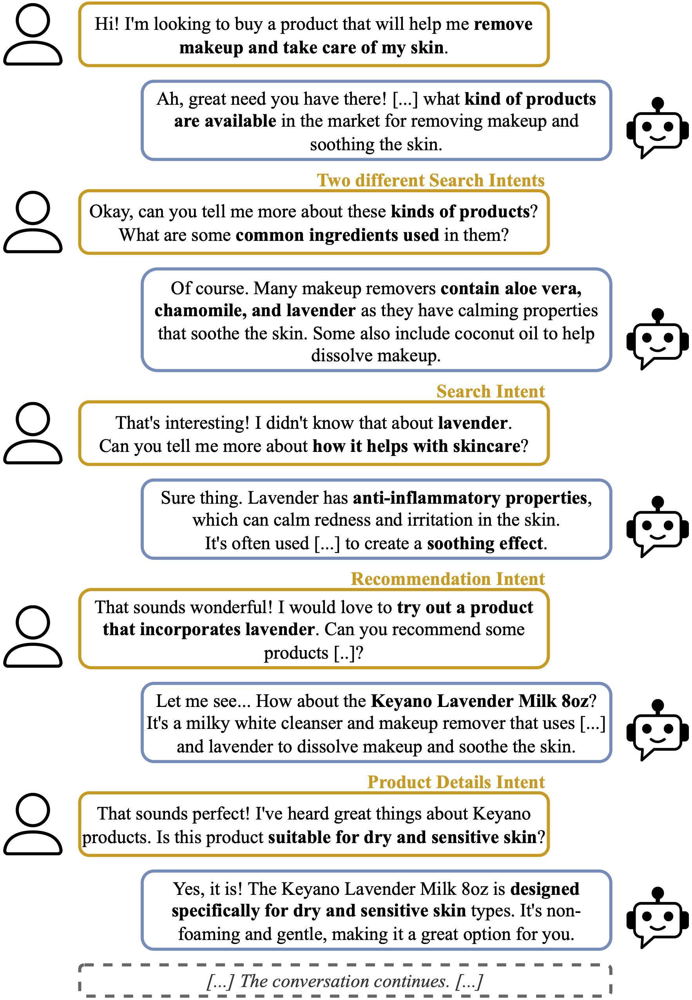
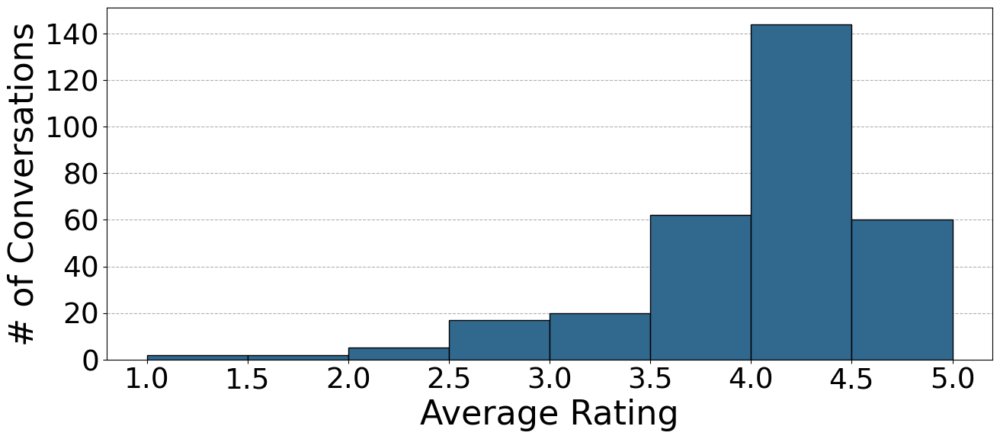
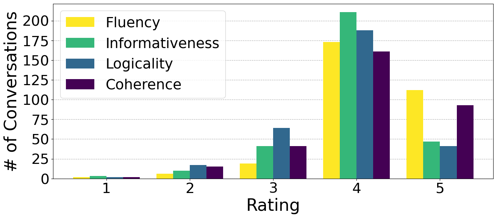
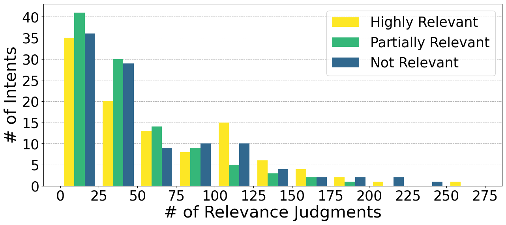

# CoSRec 

CoSRec is the first dataset explicitly designed for joint Conversational Search and Recommendation (CSR) tasks.
CoSRec comprises approximately 9,000 user-system conversations generated by a Large Language Model (LLM) in the product search and recommendation domain. These conversations encompass a variety of interactions, including pure search, pure recommendation, and mixed search-and-recommendation utterances.
To ensure the quality of the dataset, a sample of approximately 3% of the conversations has been manually annotated to identify user intents and assess overall quality. Additionally, for 20 high-quality conversations, we provide utterance-level human-generated relevance judgments for items or documents, depending on the intent of the utterance. These annotations enable precise and effective evaluation of joint CSR systems.
A key feature of CoSRec is its agnosticism toward underlying systems and evaluation paradigms. To address this, CoSRec includes separate ground truths for search and recommendation tasks, allowing researchers to apply diverse evaluation paradigms and methodologies.

CoSRec includes 9,249 conversations split into 3 partitions: 
- CoSRec-Raw: 8,938 non-annotated conversations containing 71,656 utterances.
- CoSRec-Crowd: 291 human-annotated conversations including 2,329 utterances.
- CoSRec-Curated: 20 deeply human-annotated conversations containing 150 utterances.


_Example of a conversation:_
<p align="center">
 
</p>

The CoSRec dataset comes with human-made quality assessments for a subset of 311 conversations (∼3%) corresponding to CoSRec-Crowd and CoSRec-Curated.
In particular, the annotation process involved 99 semi-expert human annotators.
The quality assessments are given on a 1 to 5 scale and concern 4 aspects: fluency, informativeness, logicality and coherence.
The distribution of the ratings provided by the annotators during the quality assessment, for the conversations in CoSRec-Curated and CoSRec-Crowd, is depicted in the following figures:
<p align="center">
 
 
</p>

Moreover, CoSRec includes also human labeled intents for each utterance of the CoSRec-Crowd and CoSRec-Curated conversations.
Each utterance is annotated with zero, one, or more among “search”, “recommendation”, and “product detail” intents:
- Search: The user asked for general information about a topic related to the product they are discussing.
- Recommendation: The user asks for some products to be suggested, according to her requirements.
- Product Detail: The user inquires about details of the product being discussed.

For the 20 CoSRec-Curated conversations, the the labeled intents were further refined by reviewing cases where annotators did not reach unanimity.
Along with intent labels, human annotators also provided a stand-alone formulation. This formulation is a self-explanatory textual description of the information need, independent of the conversation’s context, as it fully encapsulates it.
Since each conversation, and therefore each utterance, was annotated by multiple annotators, we define the longest stand-alone formulation as the canonical formulation. In contrast, the others are considered reformulations.

The CoSRec-Curated portion of the dataset contains a total of 17k relevance judgments for user intents related to search and recommendation.
The judgments for the search intents are created by following the standard TREC-style annotation procedure (pooling passages retrieved from MS-MARCO).
The judgments for the recommendation intents, instead, are created taking into account personalization. In particular, a pool of product for each intent has been retrieved from a filtered version of the Amazon Reviews catalogue using personalized requests (stand-alone formulations concatenated with some keywords representative of the user for which the request is personalized). Then the assessors were required to assess the relevance of the retrieved products for the request taking into account also a summary of the profile of the user for which the request was personalized.
For both the search and recommendation intents the relevance has been assessed employing 3 relevance labels: (0) Not Relevant, (1) Partially Relevant, (2) Highly Relevant.

The distribution of the relevance judgments for the intents labeled in the conversations of CoSRec-Curated is shown in the following figure:
<p align="center">
 
</p>

## Repository Structure

```
\
├── dataset
│   ├── crowd
│   │   ├── quality.jsonl
│   │   ├── conversations.jsonl
│   │   ├── keywords.jsonl
│   │   ├── intent_annotations.jsonl
│   │   └── profiles.jsonl
│   ├── raw
│   │   └── conversations.jsonl
│   └── curated
│       ├── quality.jsonl
│       ├── intents.jsonl
│       ├── qrels.qrels
│       ├── conversations.jsonl
│       ├── keywords.jsonl
│       └── profiles.jsonl 
├── scripts
│   └── catalogue_preprocessing.py
│   └── generate_conversations.py
└── prompts
    ├── user_summary_prompt.txt
    ├── user_keywords_prompt.txt
    ├── product_to_query_prompt.txt
    └── conversation_generation_prompt.txt
```

This repository is structured as follows:
- dataset: holds the files representing the CoSRec dataset.
    - raw: 8938 non-annotated conversations
    - crowd: 291 annotated conversations
    - curated: 20 deeply annotated conversations
- scripts: holds the scripts used to generate the conversations and the script needed to process the Amazon Reviews dataset, obtaining its filtered version (AR-filtered).
- prompts: holds the prompts used for generating the conversations, extracting a search-like query from a product, extracting the user profile summary and keywords from the reviews.


### Dataset

This directory holds the files constituting the CoSRec dataset, which is split in 3 partitions: CoSRec Raw, CoSRec Crowd, CoSRec Curated.

#### CoSRec Raw

CoSRec Raw is a set of 8938 non-annotated conversations.

The file **conversations.jsonl** contains a conversation for each line. Each conversation corresponds to a dictionary with a single key, the conversation ID, and a single value, the conversation text. The user's utterances start with "U:" and are separated from the system's utterances, starting with "S:" by means of "\n".

#### CoSRec Crowd

CoSRec Raw is a set of 291 annotated conversations.

This partitions contains the following files:

-  **conversations.jsonl**: jsonl file containing a conversation for each line. Each line corresponds to a dictionary with a single key, the conversation ID, and a single value, the conversation text. The user's utterances start with "U:" and are separated from the system's utterances, starting with "S:" by means of newline characters ("\n").
```
A line of the 'conversations.jsonl' file:
...
{
    "CoSRec-Crowd_4": "U: Hi, I'm looking to buy a book about Jasper Johns' artwork analysis.\nS: [...] \nU: [...]"
}
...
```
-  **quality.jsonl**: jsonl file containing the ratings provided by the annotators during the quality assessment. Each line of the file corresponds to a conversation. Each conversation takes the form of a dictionary with a single key, the conversation ID, and a single value, the list of ratings. The list is composed of dictionaries. Each dictionary corresponds to the ratings of a user and has as keys the quality aspects ('coherence', 'logicality', 'informativeness', 'fluency') and as values the ratings provided by the annotator.
```
A line of the 'quality.jsonl' file:
...
{
    "CoSRec-Crowd_4":[     #ID OF THE CONVERSATION
        {
            "fluency": 4,    #DICTIONARY OF THE RATINGS OF ONE ANNOTATOR
            "coherence": 4,
            "logicality": 3,
            "informativeness": 4
        }, 
        ...
        ]
}
...
```
-  **intent_annotations.jsonl**: jsonl file containing the raw human-labeled intents. Each line of the file corresponds to a conversation. Each conversation takes the form of a dictionary with a single key, the conversation ID, and a single value, the list of intents for each utterance. The list is composed of dictionaries. Each dictionary corresponds to an utterance and has two fields: the utterance id ('utterance'), which is the index of the user utterance in the conversation, and the intent list ('intent_annotations'). The intent list is constituted by a sequence of lists, each representing the intents identified for the considered utterance by a single annotator. For each intent we report the type ('type') and the stand-alone formulation ('query').
```
A line of the 'intent_annotations.jsonl' file:
...
{
    "CoSRec-Crowd_4": [    #ID OF THE CONVERSATION
        {
            "utterance": 0,    #ID (index) OF THE USER UTTERANCE WITHIN THE CONVERSATION
            "intent_annotations": [    #LIST OF ANNOTATIONS
                [{"type": "recommendation", "query": "book about Jasper Johns' artowork analysis"}],     #INTENT TYPE(s) AND STAND-ALONE FORMULATION(s) OF A SINGLE ANNOTATOR
                [{"type": "recommendation", "query": "Jasper Johns artwork analysis book"}],
            ]
        }, 
        {
            "utterance": 1,
            "intent_annotations": [
                ...
            ]
        },
        ...
        ]
}
...
```
-  **profiles.jsonl**: jsonl file containing the profile summaries of the users considered for each conversation. Each line of the file corresponds to a conversation. Each conversation takes the form of a dictionary with a single key, the conversation ID, and a single value, a dictionary containing the user profiles summaries. The user profiles summaries dictionary has as keys the IDs of the considered users and as values the summaries of the users' profiles.
```
A line of the 'profiles.jsonl' file:
...
{
    "CoSRec-Crowd_4": {    #ID OF THE CONVERSATION
        "AF7VWJNZHU27NCVHLW5O4ZIJ7TOQ": "Values academic content over presentation or novelty, prioritizes quality and precision in materials and products.",    #ID AND PROFILE SUMMARY OF A USER
        "AG6ARYX42WRYVWFCTCMJINWBRBDQ": "Someone who values relaxation and ambiance, likely appreciates unique or humorous content (e.g., love for cat-themed anecdotes), enjoys creating or experiencing pleasant fragrances (e.g., soap making), and prioritizes convenience and quality in their purchases.", 
        ...
    }
}
...
```
-  **keywords.jsonl**: jsonl file containing the profile keywords of the users considered for each conversation. Each line of the file corresponds to a conversation. Each conversation takes the form of a dictionary with a single key, the conversation ID, and a single value, a dictionary containing the user profiles keywords. The user profiles keywords dictionary has as keys the IDs of the considered users and as values the lists of keywords of the user.
```
A line of the 'keywords.jsonl' file:
...
{
    "CoSRec-Crowd_4": {    #ID OF THE CONVERSATION
        "AF7VWJNZHU27NCVHLW5O4ZIJ7TOQ": ["good", "cheap", "durable", "robust"],    #ID AND PROFILE KEYWORDS OF A USER
        "AG6ARYX42WRYVWFCTCMJINWBRBDQ": ["relaxing", "cheap", "fragrant", "addictive"],
        ...
    }
}
...
```

#### CoSRec Curated

CoSRec Raw is a set of 20 deeply annotated conversations, where the raw annotator data is manually reviewed by the authors.

This partitions contains the following files:
-  **conversations.jsonl**: same as CoSRec Crowd.
-  **quality.jsonl**: same as CoSRec Crowd.
-  **intents.jsonl**: jsonl file containing the reviewed human-labeled intents. Each line of the file corresponds to a conversation. Each conversation takes the form of a dictionary with a single key, the conversation ID, and a single value, the list of intents for each utterance. The list is composed of dictionaries. Each dictionary corresponds to an utterance and has two fields: the utterance id ('utterance'), which is the index of the user utterance in the conversation, and the intent list ('intents'). The intent list is constituted by a sequence of dictionaries, each representing a single intents and reporting: the intent id ('id'), the intent type ('type') and the list of stand-alone formulations ('query_variants'). **Note:** this file does NOT contain the personalized recommendation intents, they can be generated by combining this file with the associated user profiles that can be found in the 'profiles.jsonl' file.
```
A line of the 'intents.jsonl' file:
...
{
    "CoSRec-Curated_1": [    #ID OF THE CONVERSATION
        {
            "utterance": 0,    #ID (index) OF THE USER UTTERANCE WITHIN THE CONVERSATION
            "intents": [    #LIST OF INTENTS IN THE UTTERANCE
            {
                "id": "CoSRec-Curated_1_0_0",    #ID (index) OF THE INTENT WITHIN THE CONSIDERED USER UTTERANCE (CoSRec-Curated_<conversation_id>_<utterance_id>_<index>)
                "type": "recommendation",        #INTENT TYPE
                "query_variants": [              #STAND-ALONE FORMULATIONS (canonical formulation and reformulations)
                    "premium rubber floor car mats for Jeep Cherokee",
                    "Rubber floor car mats with premium rubber for Jeep Cherokee",
                    ...
                ]
            },
            ...
            ]
        },
        ...
    ]
}
...
```
-  **profiles.jsonl**: same as CoSRec Crowd.
-  **keywords.jsonl**: same as CoSRec Crowd.
-  **qrels.qrels**: file containing the relevance judgments for all the intents in TREC-style format (NOTE: the ground truth can be split in search ground truth and recommendation ground truth based on the topic id. The recommendation topic ids contain the character '#' while the search topic ids do not).

**Note:** the intent id (file 'intents.jsonl') takes the following form: <conversation_id>\_<utterance_id>\_\<index> where: conversation_id is the identifier of the conversation, utterance_id is the identifier of the utterance (index) WITHIN the conversation and <index> is an incremental field (counter) used to differentiate the identifiers of different intents referring to the same utterance.

**Note:** the id of the personalized intents in the qrels file ('qrels.qrels') takes the following form: <intent_id>#<user_index> where: intent_id is the id of the intent (structured as explained above) and user_index is a reference to the user for which the intent is personalized. In particular, the user_index is an integer number between 0 and 4, which correspond to the index of the user in the list of users employed to personalize the intents of the considered conversation (**ordered by lexical order of the users' identifiers**).

### Scripts

This directory holds the subdirectory 'generation' which contains the scripts used to generate the conversations and the script needed to process the Amazon Reviews dataset, obtaining its filtered version (AR-filtered).

#### How to Run

##### Catalogue Pre-processing (AR-filtered)

To run the catalogue preprocessing script, it is necessary to specify some arguments:
- threshold_too_short_description: the minimum length of the description field of a product to consider it as a valid product (default: 10).
- threshold_english_title_ascii: the percentage of characters in the title of a product that need to be standard-ASCII characters to consider the product as a valid product (default: 0.5).
- threshold_english_description_ascii: the percentage of characters in the description of a product that need to be standard-ASCII characters to consider the product as a valid product (default: 0.8).
- metas_folder (MANDATORY): the folder where all the meta data related to the products of Amazon Reviews are stored. The files can be downloaded at: https://amazon-reviews-2023.github.io/.
- reviews_folder (MANDATORY): the folder where all the reviews related to the products of Amazon Reviews are stored. The files can be downloaded at: https://amazon-reviews-2023.github.io/.
- create_output_file: boolean flag to be set to create the output file (default: True).
- output_filename (MANDATORY): name (and path) of the output file.

Example :
```
python catalogue_preprocessing.py --metas_folder "AmazonReviews/meta/" --reviews_folder "AmazonReviews/reviews/" --output_filename "processed_catalogue.jsonl"
```
##### Conversations Generation

To run the script to generate the conversations, it is required to specify these arguments:
- random_seed: the seed for the random number generator employed (default: 20250218).
- bm25_k1: the 'k1' parameter used in the BM25 formula (default: 1.2).
- bm25_b: the 'b' parameter used in the BM25 formula (default: 0.75).
- catalogue_filename (MANDATORY): path to the catalogue input file, which has been generated following the 'Catalogue Pre-processing (AR-filtered)' instruction above.
- catalogue_size: the number of products contained in the 'AR-filtered' catalogue (default: 12312760).
- num_random_products (MANDATORY): the number of products which are randomly selected from the catalogue as target items for generating the conversations. 
- num_reviews: the number of reviews for each product which are included in the generation prompt (default: 3).
- catalogue_sparse_index_folder (MANDATORY): path to the folder containing the BM25-based sparse index of the catalogue, built with Pyserini.
- catalogue_dense_index_folder (MANDATORY): path to the folder containing the TCT ColBERT-based dense index of the catalogue, built with Pyserini.
- num_products: the number of products to consider in the generation prompt (default: 10).
- documents_sparse_index_folder (MANDATORY): path to the folder containing the BM25-based sparse index of the MS-MARCO corpus, built with Pyserini.
- num_documents: the number of documents to consider in the generation prompt (default: 10).
- query_prompt_filename (MANDATORY): path to the textual file containing the prompt used to generate the query used for document retrieval.
- query_tokenizer: the name of the LLM model used to generate the query used for document retrieval, which must be the same as 'query_model' but available on Huggingface. This parameter is required, since we load its tokenizer exclusively to count, for each LLM inference, the number of tokens found in the input prompt. (default: "meta-llama/Llama-3.1-8B").
- query_model: the name of the LLM model used with Ollama framework to generate the query used for document retrieval (default: "llama3.1").
- query_max_words: the maximum nuber of words allowed for the generated query (default: 7).
- conv_prompt_filename (MANDATORY): path to the textual file containing the prompt used to generate the conversations.
- conv_tokenizer: the name of the LLM model used to generate the conversations, which must be the same as 'conv_model' but available on Huggingface. This parameter is required, since we load its tokenizer exclusively to count, for each LLM inference, the number of tokens found in the input prompt. (default: "meta-llama/Llama-3.1-8B").
- conv_model: the name of the LLM model used with Ollama framework to generate the conversations (default: "llama3.1").
- create_output_file: boolean flag to be set to create the output file (default: True).
- output_filename (MANDATORY): name (and path) of the output file.

**Note**: the catalogue processing script MUST be executed before generating the conversations.

### Prompts

This directory contains the prompts used in the interaction with LLama 3.1 8B: 

- The prompt used to generate the conversations corresponds to the file **"conversation_generation_prompt.txt"**.
- The prompt used to extract a search-like query from a product (to be used as request for the retrieval of 10 documents from MS Marco v2.1 Passage) corresponds to the file **"product_to_query_prompt.txt"**.
- The prompt used to create the user profile summary from the user's reviews is **"user_summary_prompt.txt"**.
- The prompt used to generate the user profile keywords from the user's reviews is **"user_keywords_prompt.txt"**.

